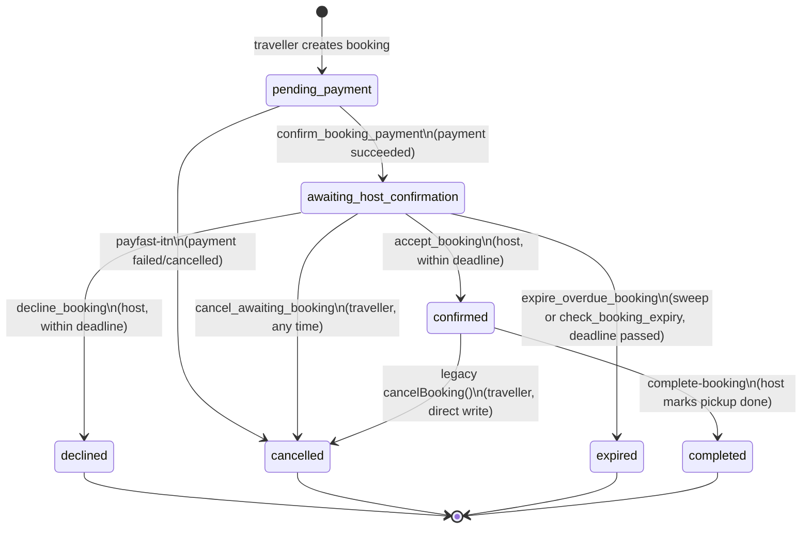

# Cubby — Booking Lifecycle

> Describes the booking state machine as it exists in the codebase today. Not a
> history of how it got here — see `PROJECT_MASTER_PLAN.md` for the phase-by-phase
> build log if you want that. Companion document: `PAYMENT_FLOW.md` (payment
> webhooks, the `confirm_booking_payment` RPC, idempotency, refunds).

---

## The rule the whole design rests on

**No client code writes `bookings.status`, `refund_status`, or any deadline
column for a booking that has ever reached `awaiting_host_confirmation`.**
Every transition out of that state — and into it, on the payment side — goes
through a `SECURITY DEFINER` Postgres function in `supabase/schema.sql`. Each
one re-validates ownership, status, and (where relevant) the deadline
*inside the database*, using the database's own `now()` and the caller's real
`auth.uid()` from their JWT — never a value the client sent. A client can
call these functions, but it cannot talk it into doing something the guard
doesn't allow, regardless of what the UI shows at the moment of the tap.

Two booking-creation-era statuses (`pending_payment`, and the legacy
`pending`) still have direct-write code paths — see "Legacy paths" below.
Everything from `awaiting_host_confirmation` onward does not.

---

## States

| Status | Meaning | Set by |
|---|---|---|
| `pending_payment` | Booking row exists, traveller hasn't paid yet | `app/(traveller)/booking.tsx` on creation |
| `pending` | Legacy pre-PayFast equivalent of `pending_payment` | Nothing creates this anymore (verified — see "Legacy paths") |
| `awaiting_host_confirmation` | Payment succeeded, host has a response window | `confirm_booking_payment` RPC (see `PAYMENT_FLOW.md`) |
| `confirmed` | Host accepted; PIN is now visible to the traveller | `accept_booking` RPC, or legacy `updateStatus()` (see below) |
| `declined` | Host declined within the window | `decline_booking` RPC |
| `cancelled` | Traveller cancelled, or payment failed/was cancelled at PayFast | `cancel_awaiting_booking` RPC, legacy `cancelBooking()`, or `payfast-itn`'s failure branch |
| `expired` | Host never responded before the deadline | `expire_overdue_booking` RPC (via sweep or `check_booking_expiry`) |
| `completed` | Host marked the pickup done | `complete-booking` Edge Function |

## Transitions

Notes on edges that might look surprising:

- **`pending_payment → awaiting_host_confirmation`** never goes through
  `confirmed`. This is the change Phase 5 made — see `PAYMENT_FLOW.md`.
- **`confirmed → completed`** is not actually guarded on the prior status
  being `confirmed` — `complete-booking`'s only status check is refusing a
  booking that's *already* `completed`. In practice it's only ever called
  from the host's confirmed-bookings view, but the database itself doesn't
  enforce that. Documented here as a known gap, not fixed.
- There is no `completed → *` or `declined/cancelled/expired → *` edge.
  These are terminal.

## Guards, actor by actor

| Function | Who can call it | Guard | Notes |
|---|---|---|---|
| `accept_booking(id)` | Host (owner or assigned) | `status = 'awaiting_host_confirmation' AND host_response_deadline > now()` + ownership | Deadline is part of the guard, not just a display concern — an accept can't land after the true deadline even if the sweep hasn't run yet |
| `decline_booking(id)` | Host (owner or assigned) | Same as accept | Also sets `refund_status = 'pending_manual'` in the same statement |
| `cancel_awaiting_booking(id)` | Traveller (owner) | `status = 'awaiting_host_confirmation'` — **no deadline condition** | A traveller can cancel right up to the moment the booking actually transitions away, regardless of how close to the deadline it is |
| `expire_overdue_booking(id \| NULL)` | `service_role` only | `status = 'awaiting_host_confirmation' AND host_response_deadline <= now()` | `NULL` sweeps every eligible row; a specific id scopes to one row. This is the *only* place the expiry transition is implemented — the sweep and `check_booking_expiry` both call this, neither reimplements it |
| `check_booking_expiry(id)` | Any authenticated party to the booking | Ownership check, then delegates to `expire_overdue_booking` | Called opportunistically by the client when a local countdown reaches zero, so an overdue booking doesn't have to wait for the next scheduled sweep tick to actually flip |
| `confirm_booking_payment(id, ref, provider)` | `service_role` only | `status = 'pending_payment'` | No `auth.uid()` — the caller is a payment provider's server, not a logged-in user. See `PAYMENT_FLOW.md` |
| `mark_refunded(id, ref)` | Any authenticated user, but... | `profiles.is_admin = true` checked inside the function, then `refund_status = 'pending_manual'` | **Has no caller anywhere in the app today.** There's no admin refund-queue screen yet — closing out a queued refund currently means invoking this RPC directly (e.g. from the Supabase SQL editor, signed in as an admin) |

All six Phase 4 functions (everything except `confirm_booking_payment`)
follow the identical shape: a single guarded `UPDATE ... WHERE <matching
state>`, which either returns the new row or matches nothing — in which case
a follow-up `SELECT` figures out *why* (not found / not the owner / wrong
status / deadline passed) purely to give the caller a specific answer. The
guarded `UPDATE` itself, not that follow-up read, is what makes concurrent
calls safe: two requests racing the same row are serialized by ordinary
Postgres row locking, and whichever loses simply matches zero rows.

## Legacy paths (pre-Phase-4/5, still present, largely inert)

Two client-side direct-write paths predate the RPCs and were never removed,
because doing so wasn't in scope for the phase that added the RPCs:

- **`updateStatus()`** in `app/(host)/requests.tsx` — writes `status:
  'confirmed'` or `'cancelled'` directly, no ownership re-check beyond RLS,
  no deadline concept. Still wired to a UI button, gated on the booking
  being in the old `pending` status. Verified (grep across `app/` and
  `supabase/functions/`): the only booking-creation path
  (`app/(traveller)/booking.tsx`) has only ever been observed to create
  `pending_payment` bookings, never `pending` — so this path is reachable in
  code but has no live data to act on.
- **`cancelBooking()`** in `app/(traveller)/bookings.tsx` — writes `status:
  'cancelled'` directly for a booking in `['pending', 'confirmed']`. Unlike
  `cancel_awaiting_booking`, it does **not** set `refund_status` — cancelling
  a *confirmed* booking today does not queue a manual refund the way
  cancelling an *awaiting* one does. Documented here as a known gap, not
  fixed as part of this write-up.

Both are intentionally left alone rather than migrated to RPCs, since
`cancel_awaiting_booking` explicitly refuses to touch a `confirmed` booking
(`reason: 'refused_confirmed'`) — the confirmed-cancellation case was a
deliberate scope boundary, not an oversight.

## PIN handling

The 4-digit PIN is generated **client-side at booking creation**
(`app/(traveller)/booking.tsx`, `Math.floor(1000 + Math.random() * 9000)`)
and stored on the row immediately — well before payment, let alone host
acceptance. There is no later transition that generates or changes it.

The only thing preventing early exposure is discipline at the *display and
transmission* layer, not the data layer:

- The traveller bookings screen only renders the PIN when
  `status === 'confirmed'`.
- No notification or email sent before acceptance includes `pin_code` — this
  was audited repo-wide (every `booking_confirmed` send site and every
  `pin_code`/`pinCode` reference) as part of Phase 5's hardening round, see
  `PAYMENT_FLOW.md` for what that covered.

## Refund queue

`refund_status` is a separate column from `status`, set to `'pending_manual'`
by `decline_booking`, `cancel_awaiting_booking`, and `expire_overdue_booking`
— always in the same statement as the status transition, so a decline (for
example) can never be recorded without its refund obligation recorded
alongside it. `mark_refunded` is the only way to move it to `'refunded'`.

There is currently no admin UI that lists `pending_manual` rows or calls
`mark_refunded` — see `PAYMENT_FLOW.md`'s refund section for the full
picture, since this is really a payment-lifecycle concern more than a
booking-status one.

## Notifications by transition

| Transition | Traveller gets | Host gets |
|---|---|---|
| Payment succeeds → `awaiting_host_confirmation` | In-app + push: "payment received, waiting on host" | In-app + push + email: new booking request |
| Host accepts → `confirmed` | In-app + push: booking confirmed (no email yet — see below) | — |
| Host declines → `declined` | In-app + push: declined, refund queued for processing | — |
| Traveller cancels → `cancelled` (from awaiting) | — | In-app + push: traveller cancelled |
| Deadline passes → `expired` | In-app + push: window ended, refund queued | In-app + push |
| Host completes → `completed` | In-app + push/email: review prompt | In-app + push/email: review prompt |

**Known gap, tracked in `PROJECT_MASTER_PLAN.md`:** there is no PIN-bearing
confirmation *email* sent at accept time. Before Phase 5, that email fired at
payment time (which was a PIN-leak bug, since the host hadn't accepted yet —
see `PAYMENT_FLOW.md`). It was removed rather than moved, because moving it
needs its own small server-side trigger (the client can't call `send-email`
directly — no secret embedded in the app). The traveller still gets an
in-app + push notification when the host accepts, so they're not left
without any signal; the email parity gap is the only thing outstanding.
